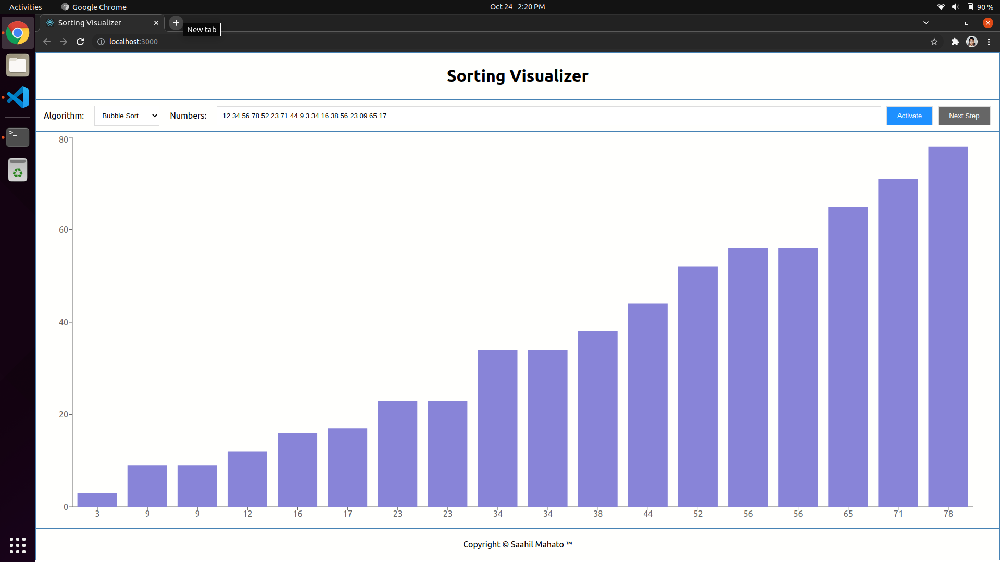
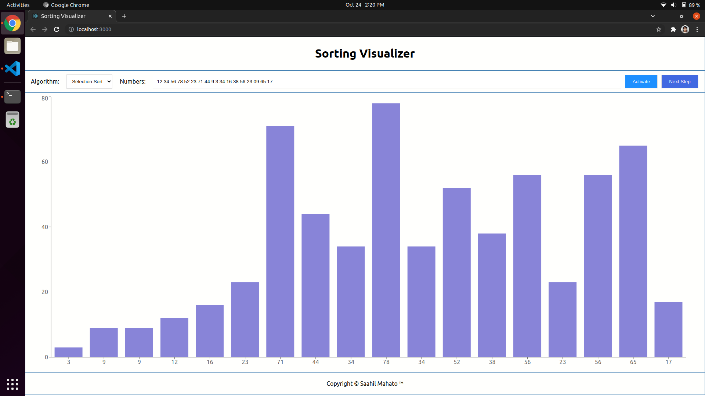

# Getting Started with Sorting visualizer

## Step 1: Choose a sorting algorithm
## Step 2: Type in the numbers (separate numbers using single space)
## Step 3: Click "Activate" button
**Now the numbers should be loaded to the graph**
## Step 4: Click "Next Step" button to reflect the changes of the next step in the graph
## Step 5: Continue Step 3 and 4 till the numbers are sorted

### Notes:
**If you change your Algorithm or input click "Activate" button again**

**Message me if you find any bugs :)**

# Few Screenshots of the application

